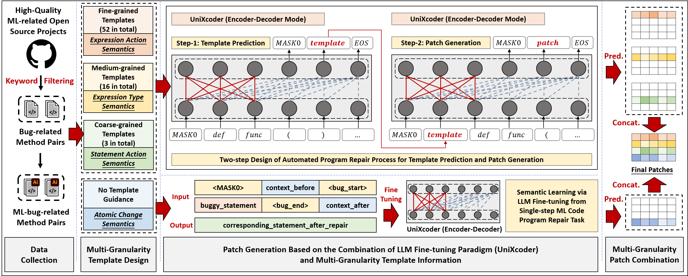

# MLRepair (Automated Program Repair for Machine Learning Systems)


I. Requirements
--------------------
 #### For MLRepair:
 - [Python 3.10.0](https://www.python.org/downloads/)
 - [PyTorch-2.0.1](https://pytorch.org/)
 - [microsoft/unixcoder-base](https://huggingface.co/microsoft/unixcoder-base)
 

II. Overview of MLRepair
--------------------


 
III. Dataset and Model Preparation
---------------------------
1. Access the [url link of our dataset](https://mega.nz/file/a9hRRRaS#cxLeKEhHBI91Vi0ClmrDS_NgHufAlv1tcXkXEtJQqmM) and download the dataset.
2. Put the downloaded dataset.tar.gz into the root directory of this repository and decompress it.
3. Access the [url link of our intermediate result](https://mega.nz/file/OwYGAD5Y#Seauusylz0lxGxeGRQXXNLcZYLGh1tEj2o68Vd2gObY) and download it.
4. Put the downloaded data into the `./run/test/` of this repository and decompress it.
5. Access the [url link of UniXcoder](https://huggingface.co/microsoft/unixcoder-base) in Hugging Face community and download this model.
6. Put the downloaded model into the root directory of this repository.

IV. Perform Repair Experiments with Already Trained Models
 --------------------------
1. Enter the path `./run/test/`.
2. Execute `python generate_result.py`.  


V. Train New Models to Perform Repair Experiments
---------------------------
If you want to train new models for repair experiments, the following steps can help:
1. Model fine-tuning for tempate prediction sub-task. Enter the path `./run/train/<granularity>/` and execute the shell `template_prediction.sh`, where `<granularity>` from \[coarse, medium, fine\].
```
  cd ./run/train/coarse/ && .\template_prediction.sh
  cd ./run/train/medium/ && .\template_prediction.sh
  cd ./run/train/fine/ && .\template_prediction.sh
```
2. Model fine-tuning for patch generation sub-task. Enter the path `./run/train/<granularity>/` and execute the shell `patch_generation.sh`, where `<granularity>` from \[coarse, medium, fine, no_template\].
```
  cd ./run/train/coarse/ && .\patch_generation.sh
  cd ./run/train/medium/ && .\patch_generation.sh
  cd ./run/train/fine/ && .\patch_generation.sh
  cd ./run/train/no_template/ && .\patch_generation.sh
```
3. Get template prediction results via fine-tuned LLMs. Enter the path `./run/test/<granularity>/` and execute the shell `template_prediction.sh`, where `<granularity>` from \[coarse, medium, fine\].
```
  cd ./run/test/coarse/ && .\template_prediction.sh
  cd ./run/test/medium/ && .\template_prediction.sh
  cd ./run/test/fine/ && .\template_prediction.sh
```

4. Assemble the predicted results into the src file for the next sub-task.
```
  cd ./run/test/ && python generate_step_2_src.py
```
        
5. Get patch generation results via fine-tuned LLMs. Enter the path `./run/test/<granularity>/` and execute the shell `patch_generation.sh`, where `<granularity>` from \[coarse, medium, fine, no_template\].
```
  cd ./run/test/coarse/ && .\patch_generation.sh
  cd ./run/test/medium/ && .\patch_generation.sh
  cd ./run/test/fine/ && .\patch_generation.sh
  cd ./run/test/no_template/ && .\patch_generation.sh
```

6. Patch combination to fuse multi-granularity templates.
```
cd ./run/test/ && python combine_result.py
```

7. Generate final repair results.
```
cd ./run/test/ && python generate_result.py
```

VI. Online Appendix
-----------------------------

### <font color='darkred'><1>. Definitions and Real-World Cases of 52 Fine-Grained Fix Templates:</font>

---

#### __FT-1. Insert Method Arguments__
##### <font color='gray'>This template is intended to add one or more new positional arguments to a method, primarily applied in scenarios such as missing positional argument, introduction of model configurations, adaptation for ML api updates.</font>
```python
-  method_call(arg_1, ...)
+  method_call(arg_1, ..., arg_k, ...)
```
```python
-  self.check_constant_initialization(x, self.a, np)
+  self.check_constant_initialization(x, self.a, np, cuda.DummyDevice)
```
---
#### __FT-2. Delete Method Arguments__
##### <font color='gray'>This template is intended to remove one or more existing positional arguments in a method, primarily applied in scenarios such as removal of unnecessary positional arguments, deletion of model condigurations, restoration of default settings, adaptation for ML api updates.</font>
```python
-  method_call(arg_1, ..., arg_k, ...)
+  method_call(arg_1, ...)
```
```python
-  self._conv_forward(input, self.weight_fake_quant(self.weight), self.bias)
+  self._conv_forward(input, self.weight_fake_quant(self.weight))
```
---
#### __FT-3. Replace Method Arguments__
##### <font color='gray'>This template is intended for replacing one or more existing positional arguments in a method, primarily applied in scenarios where there are mistakes in passing model runtime configurations.</font>
```python
-  method_call(arg_1, ..., arg_k, ...)
+  method_call(arg_1, ..., arg_v, ...)
```
```python
-  self = super().__new__(cls, len(dist))
+  self = super().__new__(cls, dist.shape)
```
---
#### __FT-4. Replace Literals with Literals__
##### <font color='gray'>This template is utilized for replacing a literal, such as a numerical, string, or boolean value, with another literal. It is primarily applied in scenarios involving changes to model runtime options or alterations in model saving paths.</font>
```python
-  ... literal_1 ...
+  ... literal_2 ...
```
```python
-  numpy.max(numpy.bincount(sources.astype('int32', copy=False)))
+  numpy.max(numpy.bincount(sources.astype('int64', copy=False)))
```
---
#### __FT-5. Replace Literals with Expressions__
##### <font color='gray'>This template replaces a literal with a non-literal expression. This template shares similarities with the application scenarios of FT-4.</font>
```python
-  ... literal ...
+  ... expression ...
```
```python
-  torch.autograd.set_detect_anomaly(True)
+  torch.autograd.set_detect_anomaly(self.training_config.detect_anomaly)
```
---
#### __FT-6. Replace Operators__
##### <font color='gray'>This template replaces one operator with another operator, encompassing arithmetic operators, comparison operators, logical operators, etc. It is primarily applied in scenarios involving modifications to model runtime triggering logic or ensuring requirements for integer operations.</font>
```python
-  ... operator_1 ...
+  ... operator_2 ...
```
```python
-  datasets.split_dataset_random(data, len(data) / 10, seed=0)
+  datasets.split_dataset_random(data, len(data) // 10, seed=0)
```
---
#### __FT-7. Replace Variables with Variables__
##### <font color='gray'>This template replaces one variable with another variable, primarily applied in scenarios involving errors in passing intermediate results, changes in model runtime parameters, or replacing functionality interfaces.</font>
```python
-  ... variable_1 ...
+  ... variable_2 ...
```
```python
-  cuda.copyto(dst, src)
+  backends.copyto(dst, src)
```
---
#### __FT-8. Replace Variables with Expressions__
##### <font color='gray'>This template is akin to the application scenarios of FT-7, with the distinction that the replaced elements are more complex expressions instead of variables.</font>
```python
-  ... variable ...
+  ... expression ...
```
```python
-  c = T.cov(x)
+  c = theano.tensor.cov(x)
```
---
#### __FT-9. Insert Conditional Expression__
##### <font color='gray'>This template introduces conditional expressions (supporting both forward and backward insertion) in control statements, loop statements, and similar contexts, enriching the existing control logic. It is primarily applied in scenarios involving changes in triggering conditions for model validation and logging, etc.</font>
```python
-  ... cond_expr_1 ...
+  ... cond_expr_1 op cond_expr_2 ...
```
```python
-  if counter % step == 0:
+  if counter != 0 and counter % step == 0:
```
---
#### __FT-10. Delete Conditional Expression__
##### <font color='gray'>This template removes existing conditional expressions (supporting both forward and backward deletion) in control statements, loop statements, and similar contexts, simplifying the existing control logic. It is primarily applied in scenarios involving changes aimed at simplifying triggering logic.</font>
```python
-  ... cond_expr_1 op cond_expr_2 ...
+  ... cond_expr_1 ...
```
```python
-  if self.features_.size > 0 and self.features_.size < self._n_features:
+  if self.features_.size < self._n_features:
```
---
#### __FT-11. Replace Conditional Expression__
##### <font color='gray'>This template modifies existing conditional expressions and is primarily applied in scenarios involving changes to model runtime triggering logic.</font>
```python
-  ... cond_expr_1 ...
+  ... cond_expr_2 ...
```
```python
-  if dist_info['backend'] == 'nccl':
+  if torch.cuda.is_available():
```
---
#### __FT-12. Insert Method Decorator__
##### <font color='gray'>In the Python language, decorators are a special syntax structure commonly used to enhance or modify the functionality of a method without modifying its original code. This template adds a decorator to a method declaration, primarily applied in scenarios such as measuring model performance, logging model runtime information, handling exception information, and separating data processing logic.</font>
```python
+  @ decorator
   def function(): ...
```
```python
+  @ tvm.testing.uses_gpu
   def test_forward_unsqueeze(): ...
```
---
#### __FT-13. Delete Method Decorator__
##### <font color='gray'>This template is used to remove unnecessary decorators and is primarily applied in scenarios such as conflicts in model code runtime logic caused by decorators, incompatible versions of decorators, adjustments in model validation and testing processes, etc.</font>
```python
-  @ decorator
   def function(): ...
```
```python
-  @ keras_test
   def test_global_maxpooling3d_legacy_interface(): ...
```
---
#### __FT-14. Replace Method Decorator__
##### <font color='gray'>This template is used to replace the original decorator and is primarily applied in scenarios of inconsistencies in functionality caused by decorators.</font>
```python
-  @ decorator_1
+  @ decorator_2
```
```python
-  @ performance_timer
+  @ tf.function
```
---
#### __FT-15. Insert Method Keywords__
##### <font color='gray'>In the Python language, keyword arguments are special arguments used to pass key-value information. This template adds one or more new keyword arguments to method, similar to the application scenario of FT-1.</font>
```python
-  method_call(k_1=v_1, ...)
+  method_call(k_1=v_1, ..., k_p=v_p, ...)
```
```python
-  f = theano.function([], conv_gemm)
+  f = theano.function([], conv_gemm, mode=mode_with_gpu)
```
---
#### __FT-16. Delete Method Keywords__
##### <font color='gray'>This template removes one or more existing keyword arguments from a method, similar to the scenarios of FT-2.</font>
```python
-  method_call(k_1=v_1, ..., k_p=v_p, ...)
+  method_call(k_1=v_1, ...)
```
```python
-  with self.session(use_gpu=False):
+  with self.session():
```
---
#### __FT-17. Replace Method Keywords__
##### <font color='gray'>This template replaces one or more existing keyword arguments within a method, akin to the scenarios of FT-3.</font>
```python
-  method_call(k_1=v_1, ..., k_p=v_p, ...)
+  method_call(k_1=v_1, ..., k_q=v_q, ...)
```
```python
-  pool2 = tf.squeeze(tf.reduce_max(conv2, 1), squeeze_dims=[1])
+  pool2 = tf.squeeze(tf.reduce_max(conv2, 1), axis=[1])
```
---
#### __FT-18. Insert Dictionary Elements__
##### <font color='gray'>This template adds one or more elements to a dictionary object, primarily applied in scenarios such as adding configurations for data preprocessing, adding parameters for model runtime, or adding items for model predictions.</font>
```python
-  {k_1=v_1, ...}
+  {k_1=v_1, ..., k_p=v_p, ...}
```
```python
-  feed_dict={self._x: x_val}
+  feed_dict={self._x: x_val, K.learning_phase():0}
```
---
#### __FT-19. Delete Dictionary Elements__
##### <font color='gray'>This template removes one or more elements from a dictionary object, primarily applied in scenarios such as removing unnecessary configurations for data preprocessing, eliminating parameters for model runtime, or streamlining items for model predictions.</font>
```python
-  {k_1=v_1, ..., k_p=v_p, ...}
+  {k_1=v_1, ...}
```
```python
-  check_backward_options = {'atol': 0.005, 'rtol': 0.001, 'dtype': numpy.float64}
+  check_backward_options = {'atol': 0.005, 'rtol': 0.001}
```
---
#### __FT-20. Replace Dictionary Elements__
##### <font color='gray'>This template replaces one or more elements within a dictionary object, primarily applied in scenarios such as changes in data preprocessing, modifications to model runtime parameters, or updates to items for model predictions.</font>
```python
-  {k_1=v_1, ..., k_p=v_p, ...}
+  {k_1=v_1, ..., k_q=v_q, ...}
```
```python
-  extra_args = {'color': (1.0, 0.0, 0.0, 1)}
+  extra_args = {'color': (255, 0, 0, 1)}
```
---
#### __FT-21. Insert Method Wrapper__
##### <font color='gray'>This template wraps an existing expression with a new method call on the outer side, referred to as a method wrapper, where the original expression becomes a parameter. It is primarily applied in scenarios such as adding neural network layers or transformation of data structures.</font>
```python
-  ... expression ...
+  ... outer_method(expression) ...
```
```python
-  outputs = self._encoder(embedded_input, sentence_mask)
+  outputs = self._dropout(self._encoder(embedded_input, sentence_mask))
```
---
#### __FT-22. Delete Method Wrapper__
##### <font color='gray'>This template removes the method wrapper, making its parameters to become directly the external expression. It is primarily applied in scenarios such as removing neural network layers or eliminating data structure type conversions.</font>
```python
-  ... outer_method(expression) ...
+  ... expression ...
```
```python
-  hidden = tf.tanh(tf.nn.xw_plus_b(output, W, b))
+  hidden = tf.nn.xw_plus_b(output, W, b)
```
---
#### __FT-23. Insert Exception Types__
##### <font color='gray'>This template adds new exception types that can be caught to a try-except statement, primarily applied in scenarios where there is a need to add the capability to catch exceptions such as improper data types during model training, arithmetic overflow, or exceeding memory.</font>
```python
-  except E_1, ...:
+  except E_1, ..., E_k, ...:
```
```python
-  except MemoryError:
+  except MemoryError, ValueError:
```
---
#### __FT-24. Delete Exception Types__
##### <font color='gray'>This template removes redundant exception types from a try-except statement, primarily applied in scenarios where it is necessary to eliminate exception types that will not occur during model runtime, to expose and reproduce exception issues, or to remove specific exception type constraints.</font>
```python
-  except E_1, ..., E_k, ...:
+  except E_1, ...:
```
```python
-  except (TypeError, IOError):
+  except:
```
---
#### __FT-25. Replace Exception Types__
##### <font color='gray'>This template modifies the exception types caught by a try-except statement, primarily applied in scenarios such as testing the robustness of a model from various angles by changing the types of exceptions caught, adaption of exception type APIs, or switching between directly specified exception types and variable-controlled exceptions.</font>
```python
-  except E_1, ..., E_k, ...:
+  except E_1, ..., E_v, ...:
```
```python
-  except errors.OutOfRangeError:
+  except self._queue_closed_exception_types:
```
---
#### __FT-26. Replace Method Call Name__
##### <font color='gray'>This template replaces the original method call name with a new name, including the replacement of prefix expressions for the method call name. It is primarily applied in scenarios such as errors in method functionalities, changes in neural network model structure, changes in activation functions, or changes in function names due to API version upgrades.</font>
```python
-  method_call_1(...)
+  method_call_2(...)
```
```python
-  trainer = Trainer(self.model, None, data_loader)
+  trainer = GradientDescentTrainer(self.model, None, data_loader)
```
---
#### __FT-27. Replace Entire Method Call__
##### <font color='gray'>This template is used to make arbitrary changes to a method call, encompassing alterations to elements such as the function call name (FT-26), positional arguments (FT-1/2/3), keyword arguments (FT-15/16/17), and other combinations. Consequently, it addresses more complex repair scenarios, similar to its included subclasses.</font>
```python
-  prefix_1.method_call_1(arg1, ...)
+  prefix_2.method_call_2(arg2, ...) or non-method-call expression
```
```python
-  self._meta_optimizer.zero_grad()
+  zero_optim_grads(self._meta_optimizer)
```
---
#### __FT-28. Insert List Elements__
##### <font color='gray'>This template adds one or more elements to a list object, primarily applied in scenarios such as adding configurations for model runtime, refactoring intermediate results in the model, or increasing parameter passing due to changes in API versions related to the model.</font>
```python
-  [e_1, ...]
+  [e_1, ..., e_k, ...]
```
```python
-  activations = ['sigmoid', 'tanh', 'relu', 'softmax']
+  activations = ['sigmoid', 'tanh', 'relu', 'softmax', 'gated_tanh']
```
---
#### __FT-29. Delete List Elements__
##### <font color='gray'>This template removes one or more existing elements from a list object, primarily applied in scenarios such as simplifying model runtime configurations, refactoring intermediate results in the model, or reducing parameter passing due to changes in API versions related to the model.</font>
```python
-  [e_1, ...][e_1, ..., e_k, ...]
+  [e_1, ...]
```
```python
-  self.fp_dtypes = [torch.float16, torch.float32, torch.float64]
+  self.fp_dtypes = [torch.float32, torch.float64]
```
---
#### __FT-30. Replace List Elements__
##### <font color='gray'>This template replaces one or more existing elements within a list object, primarily applied in scenarios such as changes in model runtime configurations, refactoring intermediate results in the model, updates to API versions related to the model, or modifications in default values for numerical types.</font>
```python
-  [e_1, ..., e_k, ...]
+  [e_1, ..., e_v, ...]
```
```python
-  self.assertAllEqual(features_shape.numpy(), [2, 8, 8, 1536])
+  self.assertAllEqual(features_shape.numpy(), [2, 9, 9, 1536])
```
---
#### __FT-31. Replace Attributes with Attributes__
##### <font color='gray'>This template replaces the original attribute value of an object with another attribute value, primarily applied in scenarios such as incorrect usage of attribute values, changes in neural network framework API versions, or optimizations in model runtime functionality.</font>
```python
-  ... object.attr_1 ...
+  ... object.attr_2 ...
```
```python
-  padding_idx = self.embeddings.padding_idx
+  padding_idx = self.embeddings.word_padding_idx
```
---
#### __FT-32. Replace Attributes with Expressions__
##### <font color='gray'>This template considers cases where both the attribute value and its prefix expression are replaced simultaneously, or where the original attribute value of an object is replaced with another expression that is not an attribute value. Its application scenarios are similar to FT-31.</font>
```python
-  ... object_1.attr_1 ...
+  ... object_2.attr_2 ... or ... expression ...
```
```python
-  fvar = tf.tile(tf.reshape(fvar, (-1, 1)), [1, self.Y.shape[1]])
+  fvar = tf.tile(tf.reshape(fvar, (-1, 1)), [1, tf.shape(self.Y)[1]])
```
---
#### __FT-33. Insert Postfix Method Call__
##### <font color='gray'>This template appends a subsequent method call to a specified expression, primarily applied in scenarios such as modifying numerical types, converting tensor types and resizing, and redirecting model runtime devices.</font>
```python
-  ... expression ...
+  ... expression.post_call() ...
```
```python
-  single_action = single_action.detach().numpy()
+  single_action = single_action.detach().cpu().numpy()
```
---
#### __FT-34. Delete Postfix Method Call__
##### <font color='gray'>This template removes a subsequent method call that is already present after a specified expression, primarily applied in scenarios such as removing redundant numerical conversions, tensor transformations, and device redirections.</font>
```python
-  ... expression.post_call() ...
+  ... expression ...
```
```python
-  x = np.array(d, dtype=np.float32).transpose()
+  x = np.array(d, dtype=np.float32)
```
---
#### __FT-35. Insert Binary Operation__
##### <font color='gray'>This template adds one or more binary operations before and after the original expression, primarily applied in scenarios such as correcting errors in original calculations, changing model architecture logic, and improving numerical computation stability.</font>
```python
-  ... operator_1 ...
+  ... operator_1 op operator_2 ...
```
```python
-  iou = tps / (fps + fns + tps)
+  iou = tps / (fps + fns + tps + 1e-15)
```
---
#### __FT-36. Delete Binary Operation__
##### <font color='gray'>This template removes part of the operands and operators from existing binary operations, primarily applied in scenarios such as correcting errors in original calculations and changing model architecture logic.</font>
```python
-  ... operator_1 op operator_2 ...
+  ... operator_1 ...
```
```python
-  assert torch.save.call_count == self.expected_count * 2
+  assert torch.save.call_count == self.expected_count
```
---
#### __FT-37. Replace Data Structure__
##### <font color='gray'>This template performs replacements among the four common data structures in the Python language (dictionary, list, tuple, set), primarily applied in scenarios such as ensuring compatibility in data interface configurations, standardizing data representation formats, and combining return values for inference results.</font>
```python
-  ... Dict or List or Tuple or Set ...
+  ... another type of data structure ...
```
```python
-  D.feat_type = ['numerical', 'Numerical', 'numerical', 'numerical']
+  D.feat_type = {0: 'numerical', 1: 'Numerical', 2: 'numerical', 3: 'numerical'}
```
---
#### __FT-38. Replace Default Types of Method Parameters__
##### <font color='gray'>This template modifies the default values of parameters in method declarations, including handling cases where default values are added or removed. It is primarily applied in scenarios such as changes to default parameter configurations for model runtime, evolution of functionalities in new API versions, and similar applications.</font>
```python
-  def function(args_1=v_p, ...): ...
+  def function(args_1=v_q, ...): ...
```
```python
-  def train_ch6(net_fn, train_iter, test_iter , device):
+  def train_ch6(net_fn, train_iter, test_iter , device=d2l.try_gpu()):
```
---
#### __FT-39. Replace Type Hints of Method Parameters__
##### <font color='gray'>This template modifies the type hints of parameters in method declarations, including handling cases where type hints are added or removed. It is primarily applied in scenarios such as improving readability of complex calculation modules, enhancing support for static analysis tools, and evolving functionalities in new API versions.</font>
```python
-  def function(args_1: type_p, ...): ...
+  def function(args_1: type_q, ...): ...
```
```python
-  def maximum(x: torch.FloatTensor, y) -> torch.FloatTensor:
+  def maximum(x: torch.FloatTensor, y: torch.FloatTensor) -> torch.FloatTensor:
```
---
#### __FT-40. Replace Type Hint of Return Value__
##### <font color='gray'>This template modifies the type hints of the return value in method declarations. Its application scenario is similar to FT-40.</font>
```python
-  def function(args_1, ...) -> return_type_p: ...
+  def function(args_1, ...) -> return_type_q: ...
```
```python
-  def device(self) -> Union[str, torch.device]:
+  def device( self ) -> torch.device:
```
---
#### __FT-41. Replace Import Statement__
##### <font color='gray'>This template replaces import statements upon which a function relies. It includes changes to import, from import, import as, and other similar statement structures, as well as modifications to internal elements within the same type. It is primarily applied in scenarios such as compatibility configuration for the evolution of ML APIs, restructuring of code of modules, and considerations for API performance optimization.</font>
```python
-  import library_1
+  import library_2
```
```python
-  import torchtext
+  import torchtext.legacy as torchtext
```
---
#### __FT-42. Insert Tuple Elements__
##### <font color='gray'>This template adds one or more elements to a tuple object. Its application scenario is similar to FT-28, except that the elements of the tuple, once declared, cannot be changed.</font>
```python
-  (e_1, ...)
+  (e_1, ..., e_k, ...)
```
```python
-  return (emb_input_seq, output_seq_list, output_idx)
+  return (emb_input_seq, output_seq_list, input_idx, output_idx)
```
---
#### __FT-43. Delete Tuple Elements__
##### <font color='gray'>This template removes one or more existing elements from a tuple object. Its application scenario is similar to FT-29, except that the elements of the tuple, once declared, cannot be changed.</font>
```python
-  (e_1, ..., e_k, ...)
+  (e_1, ...)
```
```python
-  return self.conv1(torch.reshape(x, (1, 2, 10, 20)))
+  return self.conv1(torch.reshape(x, (1, 2, 10)))
```
---
#### __FT-44. Replace Tuple Elements__
##### <font color='gray'>This template replaces one or more existing elements within a tuple object. Its application scenario is similar to FT-30, except that the elements of the tuple, once declared, cannot be changed.</font>
```python
-  (e_1, ..., e_k, ...)
+  (e_1, ..., e_v, ...)
```
```python
-  seqs_na = np.zeros((seqs_segments.shape[0], seq_length // pool_width))
+  seqs_na = np.zeros((len(seqs_segments), seq_length // pool_width))
```
---
#### __FT-45. Replace Use of Return Value__
##### <font color='gray'>This template modifies the usage form of the expression value, such as assigning or processing unused return values, or clearing used return values to unused states. It is primarily applied in scenarios where misunderstandings of in-place API operations lead to implementation errors.</font>
```python
-  expression
+  return expression (or result = expression)
#  or reverse the situation
-  return expression (or result = expression)
+  expression
```
```python
-  arr.permute(3, 0, 1, 2)
+  arr = arr.permute(3, 0, 1, 2)
```
---
#### __FT-46. Replace Jump Statement__
##### <font color='gray'>The template targets five types of statements that can cause program execution to terminate or jump (Return, Continue, Break, Raise, and Exit statements), enabling the conversion of statement types or contents. It is primarily applied in scenarios such as changes in exception handling strategies for model training, modifications to early stopping strategies, and redefining the content of return values.</font>
```python
-  Return/Continue/Break/Raise/Exit Statement
+  Another Return/Continue/Break/Raise/Exit Statement
```
```python
-  raise NotImplementedError
+  return self._add_delta(-other)
```
---
#### __FT-47. Insert Set Elements__
##### <font color='gray'>This template adds one or more elements to a set object. Its application scenario is similar to FT-28, but in this case, there are no restrictions on the order of internal elements.</font>
```python
-  {e_1, ...}
+  {e_1, ..., e_k, ...}
```
```python
-  if clamp not in {'positive', 'sigmoid'}:
+  if clamp not in {'positive', 'sigmoid', 'softmargin'}:
```
---
#### __FT-48. Delete Set Elements__
##### <font color='gray'>This template removes one or more existing elements from a set object. Its application scenario is similar to FT-29, but in this case, there are no restrictions on the order of internal elements.</font>
```python
-  {e_1, ..., e_k, ...}
+  {e_1, ...}
```
```python
-  if key in {'hiddens', 'checkpoint_on', 'early_stop_on'}:
+  if key in {'checkpoint_on', 'early_stop_on'}:
```
---
#### __FT-49. Replace Set Elements__
##### <font color='gray'>This template replaces one or more existing elements within a set object. Its application scenario is similar to FT-12.3, but in this case, there are no restrictions on the order of internal elements.</font>
```python
-  {e_1, ..., e_k, ...}
+  {e_1, ..., e_v, ...}
```
```python
-  quantized_types = frozenset({_dtypes.int8, _dtypes.uint8})
+  quantized_types = frozenset({constants.INT8, constants.QUANTIZED_UINT8})
```
---
#### __FT-50. Insert General Statement__
##### <font color='gray'>This template is used to insert a statement of any type before and after the target statement. It is primarily applied in scenarios such as adding context environment configurations for model runtime, specifying execution devices, implementing gradient management, and optimizing conditions for model validation triggers.</font>
```python
+  inserted_statement
   original_statement
```
```python
+  with tf .device('/cpu:0'):
       (B, H, T, _) = q.get_shape().as_list()
```
---
#### __FT-51. Delete General Statement__
##### <font color='gray'>This template is used to delete the statement at the target position. It is primarily applied in scenarios such as removing erroneous logical statements, canceling context environment configurations for model runtime, reverting execution devices to default settings, removing redundant gradient management configurations, and simplifying conditions for model validation triggers.</font>
```python
-  original_statement
```
```python
-  trainer.model = pretrained_model
```
---
#### __FT-52. Delete General Statement__
##### <font color='gray'>This template is used to replace the entire statement at the target position with a new statement of any type. This template effectively encompasses the functionality of most other defined templates. We consider it as a supplementary template under a general perspective.</font>
```python
-  statement_1
+  statement_2
```
```python
-  d_loss += d_loss2
+  d_loss = 0.5 * d_loss + 0.5 * d_loss2 
```
---

### <font color='darkred'><2>. Typical Repair Scenarios of MLRepair (RQ1):</font>

---
#### __(1). Matrix Operation Modification__
```python
#  test-index: 842
-  tmp = np.asscalar(np.dot(gradient.T, nat_gradient))
+  tmp = np.asscalar(gradient.dot(nat_gradient))
#  test-index: 1498
-  k_matrix = 1.0 / np.exp(distort_matrix)
+  k_matrix = 1.0 / np.exp(np.power(distort_matrix, 2))
#  test-index: 6610
-  y = dataset['T']
+  y = dataset['T'].reshape(-1, 1)
```
---
#### __(2). Tensor Calculation Modification__
```python
#  test-index: 14
-  correct_k = correct[:k].view(-1).float().sum(0, keepdim=True)
+  correct_k = correct[:k].contiguous().view(-1).float().sum(0, keepdim=True)
#  test-index: 2100
-  n_mean_calc = np.sum(np.sinh(sc) ** 2)
+  n_mean_calc = np.mean(np.sinh(sc) ** 2)
#  test-index: 5626
-  data = torch.Tensor(data.transpose(0, 3, 1, 2))
+  data = torch.Tensor(data.transpose(0, 2, 1))
```
---
#### __(3). Model Execution Device Modification__
```python
#  test-index: 2324
-  labels = torch.arange(num_classes, dtype=torch.long)
+  labels = torch.arange(num_classes, dtype=torch.long, device=scores.device)
#  test-index: 4763
-  return self .entropy_t(s).detach().numpy()
+  return self .entropy_t(s).detach().cpu().numpy()
#  test-index: 5041
-  states = torch.load(read)
+  states = torch.load(read, map_location='cpu')
```
---
#### __(4). Numeric Type Conversion__
```python
#  test-index: 1849
-  table = np.asarray(table)
+  table = np.asarray(table, dtype=np.float64)
#  test-index: 1990
-  return Variable(torch.LongTensor(p).unsqueeze(1))
+  return torch.LongTensor(p).unsqueeze(1)
#  test-index: 4595
-  test_loss += self.loss_function(outputs, targets)
+  test_loss += float(self .loss_function(outputs, targets))
```
---
#### __(5). API Replacement and Version Modification__
```python
#  test-index: 277
-  return dataset.make_one_shot_iterator()
+  return tf.compat.v1.data.make_one_shot_iterator(dataset)
#  test-index: 603
-  cov0_inv = scipy.linalg.inv(acov_list[0])
+  cov0_inv = np.linalg.inv(acov_list[0])
#  test-index: 5200
-  head.fit(y)
+  head.fit_transform(y)
```
---
#### __(6). API Configuration Modification__
```python
#  test-index: 545
-  return torch.nn.MaxPool3d(Constant.POOLING_KERNEL_SIZE)
+  return torch.nn.MaxPool3d(self.kernel_size, stride=self.stride)
#  test-index: 4254
-  block = blocks.RNNBlock()
+  block = blocks.RNNBlock(bidirectional=False)
#  test-index: 5164
-  return np.concatenate(g, g_sigma)
+  return np.concatenate((g, g_sigma), axis=0)
```
---
#### __(7). Model Execution Control Flow Modification__
```python
#  test-index: 220
-  if self.clip > 0:
+  if hasattr(self, 'clip') and self.clip > 0:
#  test-index: 4373
-  if isinstance(gen_output, tf.Tensor):
+  if tf.is_tensor(gen_output):
#  test-index: 6441
-  if isinstance(self.engine, DistributedDataParallelEngine):
+  if self.engine.is_ddp:
```
---
#### __(8). ML Type Hint Modification__
```python
#  test-index: 225
-  def forward(self , x):
+  def forward(self , x: torch.Tensor) -> torch.Tensor:
#  test-index: 1349
-  def make_output_layer(self):
+  def make_output_layer(self) -> keras.layers.Dense:
#  test-index: 5366
-  def angle_between(vector_i: np.ndarray, vector_j: np.ndarray) -> np.ndarray:
+  def angle_between(vector_i: np.ndarray, vector_j: np.ndarray) -> float:
```
---
#### __(9). Hyper-parameter Modification__
```python
#  test-index: 859
-  def __init__(self, in_features, activation_fn='Sigmoid'):
+  def __init__(self, in_features, activation_fn='Tanh'):
#  test-index: 1199
-  core.learn(n_episodes=100, n_episodes_per_fit=100)
+  core.learn(n_episodes=500, n_episodes_per_fit=500)
#  test-index: 3512
-  model.fit(dataset, nb_epoch=40)
+  model.fit(dataset, nb_epoch=100)
```
---
#### __(10). Context Manager Modification__
```python
#  test-index: 149
-  with tf.name_scope(’summaries’):
#  test-index: 748
-  with self._graph.as_default():
#  test-index: 4254
-  with hm_module.maybe_distribute(self.distribution_strategy):
+  with keras_tuner.engine.tuner.maybe_distribute(self.distribution_strategy):
```
---
VII. Structure of the Directories
 -------------------------------
 ```
  |--- README.md                :  user guidance
  |--- overview.png             :  overview of MLRepair
  |--- dataset                  :  dataset including four template granularities
  |--- main.py                  :  method starter
  |--- unixcoder-base           :  used pre-trainied LLM
  |--- run                      :  code for model training and model inference
  |------run.py                 :  entrance for model training and inference
  |------model.py               :  model definition
  |------bleu.py                :  bleu metric for model saving
  |------train                  :  scripts for model training of template prediction and patch generation
  |------test                   :  scripts for obtaining predictions for two sub-tasks and patch combination
```
